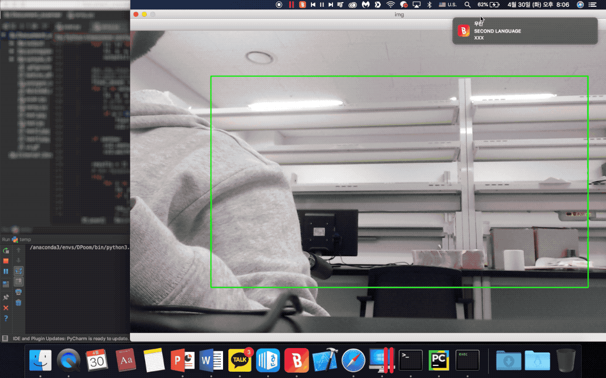
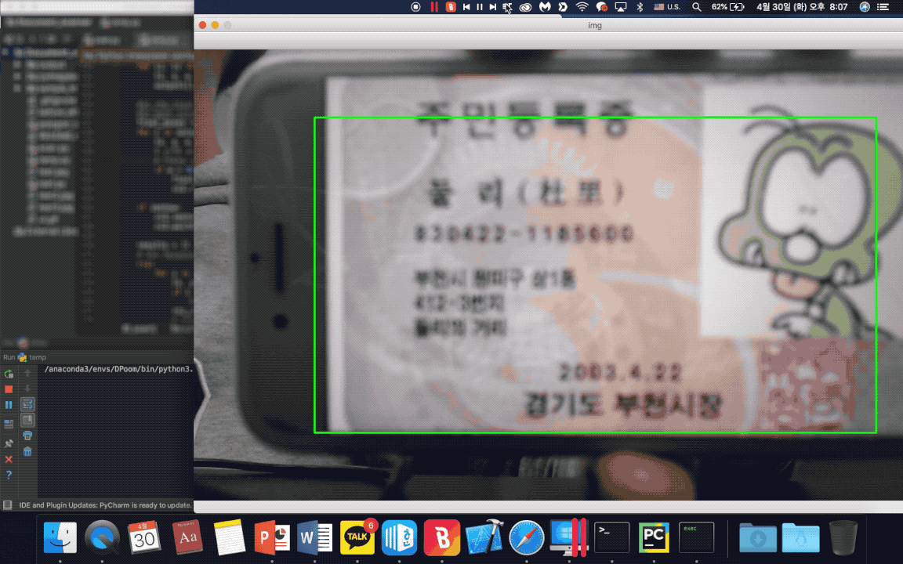

Korean-ID-Card-Scan
===

## About ID-Card-Scan
This program scans information from Korean ID Card using computer vision techniques. Only OpenCV and Tesseract libraries are being used.

## Importance
It can scan important information on Korean ID card. It can be used at many situations that needs to automatically scan ID card. Currently, it is going to be used at fully-automated hotel (무인 호텔, 무인텔 등) in South Korea.
 
 - The stage of this project  
    - [ ] Foster Ideas
    - [ ] Focus Ideas
    - [ ] Develop Ideas
    - [ ] Prototypes and Trials
    - [X] Product Development Activities
    - [ ] Launch
    
 - Goal
    - The final goal of this project
        - Correctly scan ID card ([TRL](https://itec.etri.re.kr/itec/sub01/sub01_07.do) : 3 ~ 5)
        - Integrate with API server
        
 - Keywards
    - OCR
    - Segmentation
    - Tesseract
    - Computer Vision
    - OpenCV
  
- Environment
    - _SOFTWARE_
      - Python 3.6
      - OpenCV 3.4.3.18
      - Tesseract 4.0
      - Ubuntu 16.04 LTS, Window 10, macOS
    - _HARDWARE_
      - Any hardware that could run OpenCV
      - Any camera can recognize letters cleary

## Result
The GIF below show the general procedure of my program. It contains a special process to recognize korean correctly. Currently, my code reads 'Name, ID number and Date' on the ID cards.

In my labtop (MacBook Pro 15-inch, 2015, 2.5 GHz Intel Core i7), the __execution time is 0.5 sec.__

## Source Code
The entire project is funded by Oasys Story. The source code coult not be open.  __The all copyrights are reserved to Oasys Story (2019).__
<http://www.oasyss.co.kr>
